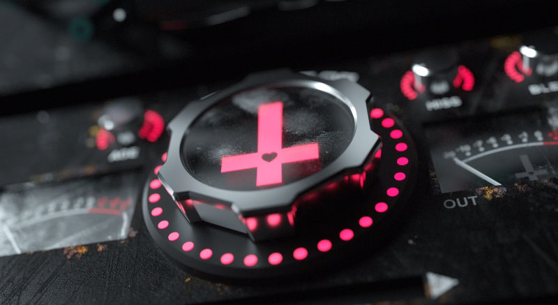
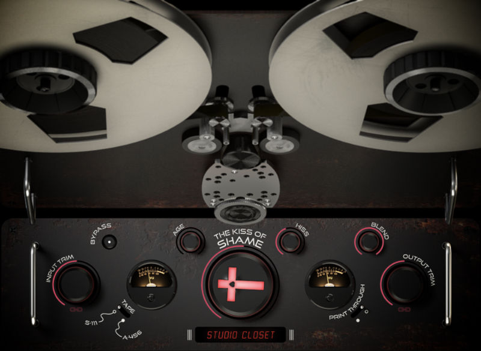

# The Kiss of Shame – Tape Desecration Processor

“Something so wrong never sounded so right.”

‼️‼️‼️ **WARNING! I've received a report that this plug-in can output very loud feedback noises. I have not been able to reproduce this. Unfortunately, I can't fix the problem if I don't know where it comes from. Be careful when using this plug-in, and just in case put a limiter behind it!** ‼️‼️‼️

The Kiss of Shame, debuted at the Audio Engineering Society Convention 2014 in Los Angeles, was a pioneering DAW plugin that leveraged commercial UX/UI design principles to shape its magnetic tape + circuitry emulation algorithms.



To differentiate itself in the competitive pro-audio plugin market, The Kiss of Shame introduced groundbreaking features including an interactive, multi-touch-ready GUI and analog tape degradation simulation for distinctive audio effects.

The Kiss of Shame was the worlds first (and perhaps only) tape / analog circuitry emulation plugin that realistically models the effects of magnetic particle instability, lubricant loss, substrate deformation, drift, scrape-flutter, print-through and reel expansion/contraction into a suite of FX processing tools for sound design and music production.

It was also the first to leverage machine learning to account for the vast nonlinearities inherent in magnetic tape and analog circuitry. Last but not least, it's the only analog tape emulation that has fully-interactive reels that support touch and can write flange automation on-the-fly akin to a real analog tape deck.

[Watch a short demo video](https://github.com/hollance/TheKissOfShame/raw/main/Unused/Promotional/TKOS_demo.mp4)

## About this open source project

The Kiss of Shame was not completely finished and never saw a release. The source code was graciously donated to the open source community by its owner in 2024.

The goal of this open source project is:

1. To finish the plug-in and make binary releases available. [DONE]
2. Figure out how it works and document the code for eductional purposes. [DONE]
3. Potentially, improve the code.

> **NOTE:** The source code that was donated does not contain all the features from the description. Notably, there is only one tape type and one environment (Hurricane Sandy), and the print-through function is missing. In its current form the plug-in only works well at a 44100 Hz sample rate. That said, it's still a fun plug-in with a cool UI, and there's a lot to learn from the source code!

## Installation instructions

> **NOTE:** This is currently work-in-progress. There may be issues with the plug-in!

### Mac

The Mac version of the plug-in is signed and notarized.

1. Download **KissOfShame-Mac.zip** from the [Releases page](https://github.com/hollance/TheKissOfShame/releases).
2. In your **Downloads** folder, double-click **KissOfShame-Mac.zip** to unzip the file.
3. Copy **KissOfShame.component** to the folder **/Library/Audio/Plug-Ins/Components**
4. Copy **KissOfShame.vst3** to the folder **/Library/Audio/Plug-Ins/VST3**
5. In your DAW, look for **Infernal Love > The Kiss of Shame**. You can insert this plug-in on a mono or stereo track.

If the AU version of the plug-in is not visible in your DAW, open **Applications/Utilities/Terminal**. Type the following and press the enter key:

```bash
killall -9 AudioComponentRegistrar
```

Then restart your DAW. Now the plug-in should be visible. If not, reboot your computer.

### Windows

1. Download **KissOfShame-Windows.zip** from the [Releases page](https://github.com/hollance/TheKissOfShame/releases).
2. In your **Downloads** folder, right-click **KissOfShame-Windows.zip** and choose **Extract All...** to unzip the file.
3. Copy **KissOfShame.vst3** to the folder **C:\Program Files\Common Files\VST3**
4. In your DAW, look for **Infernal Love > The Kiss of Shame**. You can insert this plug-in on a mono or stereo track.

## How to use this plug-in



**Choose between two distinct tape types:**

**S-111** – A superior reel format popular from the 50s to 70s, was the preferred reference tape for many engineers. The Kiss of Shame introduces its first digital emulation, bringing this legendary format to the digital world.

**A-456** – This classic, high-output/low-noise format is a recording staple used in countless productions. While many software emulations exist, none recreate it quite like this. Unique digital recreation tactics were employed to capture its essence.

> **NOTE:** The tape type selection button currently has no effect.

**From Weathered to *Weather***:

**Age** – This knob allows the user to legislate the amount of hypothetical time the selected tape type has been subjected to the chosen "Environment" to manipulate the severity of the corresponding effects.

**Environment** – Choose between several simulated storage conditions to inflict the sonic ramifications of factors such as magnetic particle instability, oxidation, lubricant loss, tape pack expansion/contraction, "vinegar syndrome" and more upon the source material. Users can even choose a "Hurricane Sandy" setting to access processing modeled from tape immersed and then recovered from the storm's flood waters.

> **NOTE:** Only the Hurricane Sandy environment is implemented.

**A real-world obstacle:**

**Shame** – The Kiss of Shame recreates the full spectrum of these factors like Drift, Wow, Flutter and Scrape-Flutter which the user can impart with the center knob. It can take your source signal from mildly colored to totally mangled.

**Print-Through** – Also known as "bleed-through", this emulation captures the mechanical speed fluctuations present in analog recordings. While they posed challenges for engineers in the past, they became a hallmark of classic records.

> **NOTE:** The print-through feature is not implemented.

**Reach out and touch tape:**

The Kiss of Shame is the first tape plug-in to feature animated, interactive reels that can be manipulated with a simple click or touch. This allows users to access authentic analogue tape flange in real-time, without the need for two physical tape decks, and in a fraction of the time. All parameters, including reel movements, are fully automatable, and for screen real estate optimization, the reels are collapsible and fully customizable.

> **TIP:** To flange, drag on the reels. To collapse the reels, double-click anywhere in the UI.

## Building from source code

### Projucer
Brief instructions:

- Install JUCE 7 or newer.
- Open **KissOfShame.jucer** in Projucer and export to your IDE.
- Select the **VST3** or **AU** target and build.

Currently only tested with:

- JUCE 7.0.9
- Xcode 15.2 + macOS Sonoma 14.3
- Visual Studio 2022 + Windows 10

### CMake

To set up CMake builds, make sure you have CMake and Ninja installed. Ninja is configured for fast compile times by default, but if you don't want to use it, omit '-G Ninja' from the configure script below and manually specify the number of jobs.
[Check CMake docs on how to do this](https://cmake.org/cmake/help/latest/manual/cmake.1.html#cmdoption-cmake-build-j)

Configure your project (fetches JUCE, sets up JUCE project):

```
cmake -B "build" -G Ninja
```

Build your project:

```
cmake --build "build" --config Release --target all --
```

Replace '--config Release' with '--config Debug' for debug builds.

Builds are automatically copied into sensible folders for your target platform (e.g: `C:\Program Files (x86)\Common Files/VST3/` for Windows), making it easy to open this plugin in your DAW during development.
Builds will also be located under `build/TheKissOfShame_artefacts/(Release or Debug)`.

AAX compilation is not enabled but can be enabled by adding `AAX` to the `FORMATS` definition under `juce_add_plugin` in `/CMakeLists.txt`. To compile for AAX, you need to specify the location of the AAX SDK with `juce_set_aax_sdk_path("  ...  ")`. This has not been tested yet.

## How it works

I've added comments to the code to explain what it does, but for a full walk-through, check out [my blog post](https://audiodev.blog/kiss-of-shame/).

## Changes from the original

The original code was written using JUCE 3.1. It required the user to copy a folder with image and sound files to `/Users/Shared/KissOfShame`. The parameters were not exposed to the DAW and would reset when the editor re-opened.

The following changes were made in this repo:

- Converted to JUCE 7.
- General code cleanup, fixed compiler warnings, added some comments.
- Put the parameters into AVPTS, added state saving & loading.
- Embedded the graphics and audio resources into the plug-in binary.
- Added support for Windows and Apple Silicon Macs.
- Changed the knobs from rotary to vertical drag.

## TO-DO list

Bugs I found (or introduced hehe):

- [FIXED] ~~The Link buttons under the input/output knobs disappear when the reels are hidden.~~
- Sometimes there is an extremely loud glitch. Not sure yet what causes this, maybe some uninitialized memory. Hard to reproduce.
- The hacky way I've implemented the Link Input/Output mode may be problematic. Sometimes this gives an assertion on `beginGesture` being called twice. Not a massive problem but not great either.
- [FIXED] ~~When restoring state, the Shame knob's cross is in the right position but the colored track isn't shown.~~
- [FIXED] ~~When the Hurricane Sandy environment is active, moving the Age knob to the minimum position can cause the low-pass filter to give a massive gain boost.~~

Other things that can / should be improved in the code (volunteers welcome!):

- Don't hardcode the sample rate to 44100 Hz.
- [FIXED] ~~Add `prepareToPlay()` and `reset()` methods to the DSP classes. The reset method should clear out old state.~~
- Allocate buffers ahead of time and copy into them, rather than doing `audioGraphProcessingBuffer = audioBuffer`, which may allocate (at least the first time).
- The envelope generators (`Envelope` and `EnvelopeDips`) could keep track of the prev and next point, so we don't have to loop through all the points at every timestep.
- Often the loop for the channels is nested inside the loop for the samples, which can be inefficient.
- Shame effect: The code allows for interpolating between the wavetables but all wavetables have the same data in it.
- Reel animation: Don't set framesPerSecond to 0 to stop the animation.
- `audioProcessor.curPositionInfo` uses a deprecated API.
- There are some data races between the editor and processor. For example, VU meter RMS readings should be atomic, and ideally be independent of the block size.
- Remove most of the compiler warnings. (I set the warning level high on purpose.)
- Replace the Biquads with TPT / SVF filters.
- [FIXED] ~~Don't use `rand()` and `srand()`. Replace with `juce::Random`.~~
- Parameter smoothing.
- When you put the plug-in in bypass mode, change the Age or Shame controls, and disable bypass, there can be a glitch because old filter state etc no longer makes sense.

Maybe:

- When you drag to apply flanging, I would expect a mouse up to reset the flanging depth, since the animation does return to normal speed.
- Skew the flange depth so that shorter delays are easier to dial in. (For example by doing `targetDepth = depth * depth * 1000.0f`.)
- Oversampling. The saturation stage can easily add aliases.
- [FIXED] ~~Use CMake instead of Projucer~~.
- Add AAX support.

## Credits & license

Copyright (C) 2014-2015 Eros Marcello

Original developers:

- [Eros Marcello](https://www.github.com/erosmarcello) — Founder, Chief Product Architect

- [Brian Hansen](https://brianhansen.sonimmersion.com/) — DSP Engineering / Algorithm Development

- [Yannick Bonnefoy](https://nanopsy.tv/) — GUI

Updates and improvements by [Matthijs Hollemans](https://audiodev.blog) and contributors.

This program is free software: you can redistribute it and/or modify it under the terms of the [GNU General Public License](https://www.gnu.org/licenses/gpl-3.0.en.html) as published by the Free Software Foundation, either version 3 of the License, or (at your option) any later version.

Some of the code in this repo (the `Granulate` class) was taken from [The Synthesis ToolKit in C++ (STK)](https://github.com/thestk/stk) by Perry R. Cook and Gary P. Scavone.

JUCE is copyright © Raw Material Software.

VST® is a trademark of Steinberg Media Technologies GmbH, registered in Europe and other countries.
